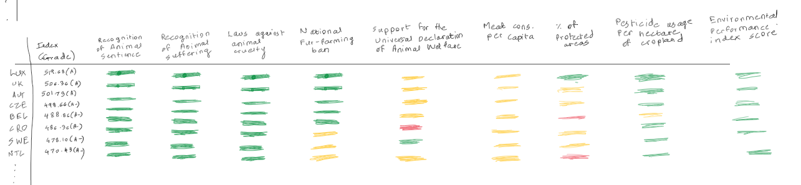

| [Home page](https://rutuja2197.github.io/rutuja-dataviz-portfolio/) | [data viz examples](dataviz-examples.md) | [critique by design](critique-by-design.md) | [final project I](final-project-part-one.md) | [final project II](final-project-part-two.md) | [final project III](final-project-part-three.md) |

# Critique by Design: MakeoverMonday  
This is a critique of the Animal Rights Index 2023 visualization from MakeoverMonday, evaluating its effectiveness in presenting global variations in animal welfare.

## Step one: the visualization

<b>Visualization Title:</b> Animal Rights Index 2023

<b>Source:</b> The Swiftest

<b>URL:</b> [https://theswiftest.com/animal-rights-index/#:~:text=Animal%20rights%20laws%20vary%20greatly,cruelty%20any%20way%20they%20can](https://theswiftest.com/animal-rights-index/#:~:text=Animal%20rights%20laws%20vary%20greatly,cruelty%20any%20way%20they%20can) 

<b>Summary:</b> 
This visualization presents the Animal Rights Index 2023, ranking countries based on their animal welfare rights. The index considers factors such as the recognition of animal sentience, recognition of animal suffering, laws against animal cruelty, national fur-farming ban, support for the universal declaration of animal welfare, meat consumption per capita, percentage of protected areas, pesticide usage per hectare of cropland, and environmental performance index score. The data is displayed in a ranked table and is both color-coded as well as icon-based, highlighting variations in multiple attributes contributing to animal rights across different countries.

<b>Why I Chose This Visualization:</b> 
I am an animal lover, and as I was going through different visualizations, this one instantly caught my eye. Since I have a pet dog, I was curious to check which country would be the best for my dog and which one would be the worst. Additionally, the visualization had a lot going on—multiple elements, colors, and rankings—which made it interesting to critique. I wanted to analyze whether all the information was presented effectively or if the complexity affected its clarity.

## Step two: the critique
The Animal Rights Index visualization on <i>The Swiftest</i> presents several challenges that affect its effectiveness.  The design is cluttered with inconsistent icon usage and a lengthy table format, making it difficult for users to quickly find the top and bottom countries, which would be most relevant to the primary audience — pet owners or individuals seeking pet insurance, since <i>The Swiftest</i> is a pet insurance website. While factors and weights are provided at the end of the table, it’s hard to correlate them with the scores just by looking at the table, making it confusing. The lack of explanation for the grading system and the use of solid circles for some metrics and icons for others creates confusion.

The visualization offers moderate usefulness but falls short due to the difficulty in quickly extracting actionable insights from the long table format. In terms of completeness, while it covers a broad range of countries, the lack of detailed information on the scoring methodology and country-specific laws weakens its overall effectiveness. Perceptibility is hindered by the inconsistent use of icons and varying color schemes, which complicate the task of quickly understanding the data. The truthfulness of the data appears solid, and provides a reference of multiple sources. Intuitiveness suffers because of the overwhelming table format and unclear layout, making it hard for users to navigate. The aesthetics are inconsistent, with varying icon styles and color schemes detracting from a cohesive design. Lastly, the engagement level is moderate, as users may find the information relevant but not interactive enough to keep them engaged for long periods.

For improvement, I recommend using a bar graph to display the top 20 and bottom 20 countries in a more digestible format, allowing users to instantly grasp the key information. A more detailed table could be included for users looking for deeper insights. I would also suggest utilizing a uniform color gradient for all metrics—whether numerical or categorical—to improve the overall visual consistency and make the data easier to interpret. Finally, clarifying the scoring methodology and incorporating a clear explanation of the rankings would enhance the transparency and usefulness of the visualization.

## Step three: Sketch a solution

  
  

## Step four: Test the solution

The focus was to understand how the visual works for different viewers and what changes could be made to improve clarity, usefulness, and engagement. I asked the participants to evaluate both the charts separately and together to see if any patterns or insights emerged. 

### Questions to ask:

- Can you describe to me what this is telling you?
- Who do you think this is intended for?
- Is there anything you find surprising or confusing?
- Is there anything you would change or do differently?
- Overall, do you find this easy to read?

These were the main questions I aimed to target, and I asked them for both the charts separately and together.

### Results:
- Can you describe to me what this is telling you?: Both interviewees found the visualization easy to understand for both charts. One suggestion was to group certain factors together to avoid making the table too large.
- Who do you think this is intended for?: While splitting the chart into two made it clearer, one interviewee still felt the visualization was more suited for animal activists. A suggestion was made to adjust the title of the first graph to better target pet owners or insurance seekers.
- Is there anything you find surprising or confusing? : The factors listed in the table were found confusing by both interviewees. There was a general sense of uncertainty about the metrics used for ranking countries.
- Is there anything you would change or do differently? : There were suggestions to show only the top 10 and bottom 10 countries instead of 20, to make the chart more concise. Another recommendation was to use gradient colors to represent the grades assigned to each country for better clarity.
- Overall, do you find this easy to read?: Both interviewees agreed that the revised version was easier to read compared to the original visualization. They appreciated the use of the heatmap and the division into two parts, which helped with readability.

### What I learned:
The feedback highlighted a few key areas for improvement in my redesign. Grouping related factors together could help reduce the table's size, making it easier for viewers to interpret the data. The suggestion to use gradient colors aligns with the need for clearer visual cues that indicate the severity of scores. Additionally, adjusting the title to better target the right audience could increase engagement, especially among pet owners or insurance seekers rather than animal activists. The feedback on confusion regarding the factors also points to the need for clearer explanations or a key that ties the factors to the rankings in a more intuitive way.

## Step five: build the solution

Final Solution:

For my final redesign of the Animal Rights Index visualization, I focused on simplifying the layout to improve readability and clarity. After gathering user feedback, I decided to:

Split the Data into Two Sections: Instead of presenting a long table with all the countries, I separated the rankings into two sections: the top 10 and the bottom 10 countries. This change aimed to make the data easier to digest and allowed viewers to focus on the most important countries in the rankings without being overwhelmed by too much information.

Use a Heatmap: To improve visual clarity, I replaced the mixed icons and colors with a heatmap. This makes it easier for viewers to immediately see which countries perform better or worse in terms of animal rights protection. The heatmap uses gradient colors that correspond to the ranking scores, allowing for an intuitive understanding of the data at a glance.

Clarify the Factors and Scores: I grouped related factors in the table and provided clear explanations of how each factor contributes to the overall score. This helped reduce confusion about the metrics being used and made the rankings more transparent.

Simplified Titles: Based on feedback, I adjusted the titles for both charts to better align with the intended audience, especially pet owners and insurance seekers. This change was made to ensure that the visualization was more relevant to the right group of users.

Process Summary:

The process of redesigning this visualization involved first reviewing the original layout and identifying its weaknesses, which included an overwhelming table format, confusing icons, and a lack of clarity regarding the scoring methodology. I then proceeded to create wireframes that broke the content into more digestible parts and used a heatmap to represent the data more effectively.

Next, I conducted interviews with two individuals to gather user feedback. I specifically focused on whether the changes improved readability and if the data presented was clear. Their input highlighted the need for grouping related factors and making the title more specific to the audience, which were incorporated into the final solution.

Overall, this redesign process reinforced the importance of clarity, simplicity, and ensuring the visualization speaks directly to the needs of its intended audience.

Final Redesign:

Below is the final redesigned version of the Animal Rights Index visualization:

Documentation and Wireframes:

The wireframes and detailed redesign process, along with the user feedback, have been documented in the attached files, as required for submission. This includes:

A screenshot of the original data visualization
A detailed explanation of my design choices and changes
Wireframes showing the layout before and after the redesign
A summary of user feedback and how it influenced the final design

## References
- [https://theswiftest.com/animal-rights-index/#:~:text=Animal%20rights%20laws%20vary%20greatly,cruelty%20any%20way%20they%20can](https://theswiftest.com/animal-rights-index/#:~:text=Animal%20rights%20laws%20vary%20greatly,cruelty%20any%20way%20they%20can)

## AI acknowledgements

