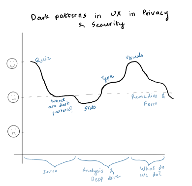
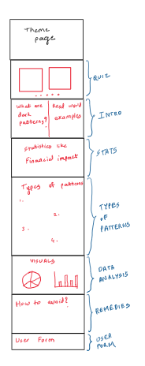

| [Home page](https://rutuja2197.github.io/rutuja-dataviz-portfolio/) | [data viz examples](dataviz-examples.md) | [critique by design](critique-by-design.md) | [final project I](final-project-part-one.md) | [final project II](final-project-part-two.md) | [final project III](final-project-part-three.md) |

# Outline
Dark patterns are deceptive design choices in user interfaces that manipulate users into taking actions they might not have intended. These patterns can infringe on user privacy, lead to unintended financial commitments, or create misleading experiences.

This project aims to:
- Educate users on what dark patterns are and their impact.
- Showcase real-world examples and statistics on their prevalence.
- Highlight the most common and harmful dark patterns.
- Provide actionable steps for users to recognize and combat them.
- Collect user-submitted examples to build a dataset of observed dark patterns.
By making this information interactive and engaging, the project seeks to raise awareness and encourage ethical design practices.

## Goal, Target Audience & Call to Action
### Goal Statement:
As a general internet user, I want to understand how dark patterns in UX manipulate my actions, so that I can recognize and avoid deceptive designs that compromise my privacy and financial security.

### Target Audience:
General users, primarily 18-65 years old as they are the most active users of websites and apps, who are unaware of dark patterns.

### Call to Action:
I can do this by raising awareness about dark patterns, educating others on how to spot them, and contributing to a crowdsourced dataset of real-world dark pattern examples.

### Future Action:
Once I collect enough data from users, I will analyze and showcase the findings which will allow users to see real-world examples of dark patterns submitted by others, recognize emerging trends, and better understand how deceptive design practices impact them.

## Project Structure & Story Flow
### Introduction (Engagement Hook – Interactive Quiz)
- A short, interactive quiz with 5 questions.
- Users will be shown two images and asked to identify which one is deceptive (certain people might not be aware what dark patterns are, so would frame the questions accordingly).
- The goal is to make users aware of how easily they can be deceived.
### Section 1: Understanding Dark Patterns
- Definition of dark patterns in UX.
- Overview of their role in privacy and security violations.
- Real-world examples from popular websites/apps.
### Section 2: Impact of Dark Patterns
- Statistics on how dark patterns affect users (privacy breaches, financial loss, etc.).
### Section 3: Types of Dark Patterns
- Breakdown of various types of dark patterns (e.g., Forced Continuity, Roach Motel, Hidden Costs).
- Brief explanation of each with visuals and real-world applications.
### Section 4: Data Visualizations
- Research-backed insights on user deception.
### Section 5: Combating Dark Patterns
- Ethical design principles and best practices.
- Steps users can take to identify and avoid dark patterns.
- Role of regulations (e.g., GDPR, FTC guidelines) in reducing dark patterns.
### Section 6: User Contribution – Building a Dataset
- A form allowing users to submit dark patterns they have encountered.
- Data collection to create a repository of deceptive UX practices. 

## Initial sketches 

  
  

  
<em>Left: Storyboarding a user's journey on the page | Right: Page Layout</em>

# The data 
I have collated a few datasets with different categories of dark patterns and their examples along with a few research papers which highlight statistical analysis of dark patterns. I will be utilizing these as below-

### Pre-collected Dataset on Dark Patterns:  
These datasets contain categorized examples of various dark patterns observed in digital interfaces. Each entry includes:
  - Category of Dark Pattern (e.g., Sneak into Basket, Forced Continuity, Roach Motel, etc.).
  - Example websites/apps where these patterns have been identified.

This dataset will be used to create a pie chart in Tableau, visualizing the most dominant dark pattern categories based on frequency.

### Statistics from Published Research & Reports:  
I have gathered key statistics from various studies and consumer reports highlighting the financial and privacy impact of dark patterns. One key metric I will highlight is the financial losses caused by deceptive practices, presented in a visually prominent format. These statistics will be used to support the narrative and demonstrate the real-world consequences of dark patterns.

### User-Submitted Dark Pattern Reports (Future Dataset): 
A form will be embedded on the project page, allowing users to submit dark patterns they’ve encountered on websites and apps. The collected submissions will include:
  - Website/App Name
  - Dark Pattern Type
  - Description of the deceptive practice
 
Over time, this will help create a user-generated dataset that can be analyzed and visualized in future updates of the project.

Below are the 3 pre-collected datasets that I will be referring to -
- [Kaggle Dataset](https://www.kaggle.com/datasets/rohitdnath/dark-pattern-dataset?resource=download&select=dark_pattern_classifications.csv)
- [Github Dataset](https://github.com/yamanalab/ec-darkpattern)
- [Additional Research](https://zenodo.org/records/3601501)

# Method and medium
For my final project, I will use a combination of **Excel, Tableau, and Shorthand** to create an interactive and engaging experience:  

- **Excel**: I will manipulate the dataset on dark patterns using Excel.  
- **Tableau**: I will create visualizations to illustrate statistics on dark patterns, their impact, and common types. These visualizations will be published on Tableau Public and embedded into the project.  
- **Shorthand**: I will use Shorthand to design the final interactive story, incorporating text, images, quizzes, and embedded Tableau visualizations to guide the user through the narrative.  

This approach ensures a data-driven, visually engaging, and interactive experience that effectively communicates the impact of dark patterns in UX.

## References
- https://www.choice.com.au/consumers-and-data/data-collection-and-use/how-your-data-is-used/articles/deceptive-dark-patterns-explainer
- https://trustarc.com/wp-content/uploads/2024/02/Deceptive-Patterns-Consent-Privacy-Infographic.png
- https://verasafe.com/blog/dark-patterns-how-to-detect-and-avoid-them/
- https://link.springer.com/chapter/10.1007/978-3-031-28643-8_9#Sec7
- https://therecord.media/ftc-audit-finds-dark-patterns-global
- https://webtransparency.cs.princeton.edu/dark-patterns/
- https://www.cxtoday.com/voice-of-the-customer/dark-patterns-deceiving-customers-and-eroding-trust/
- https://dovetail.com/product-development/new-research-finds-online-consumers-are-falling-victim-to-dark-patterns/

## AI acknowledgements

